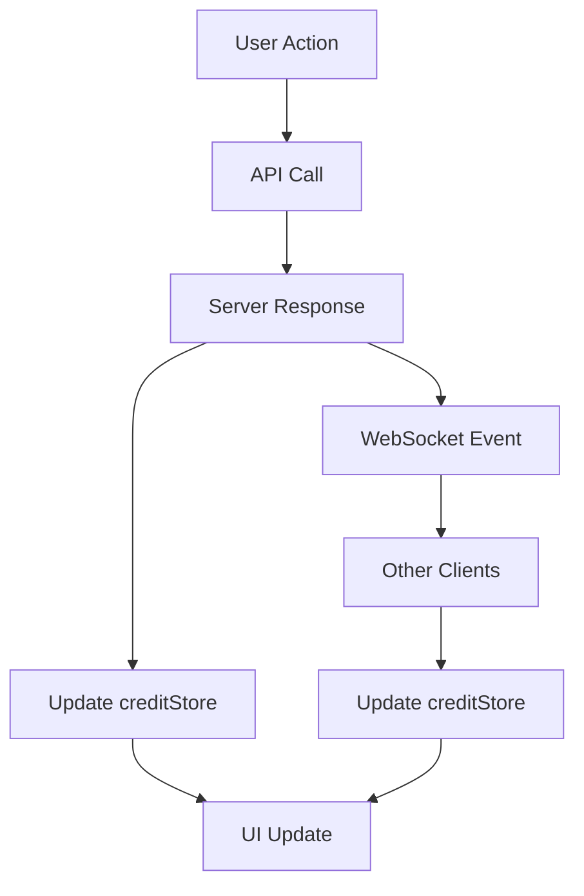
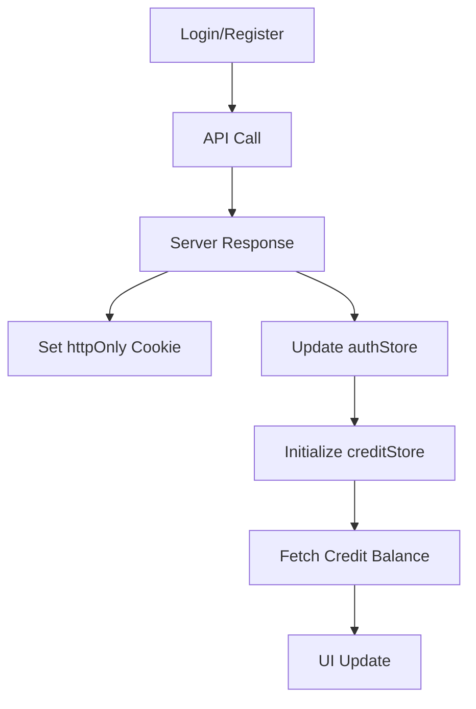
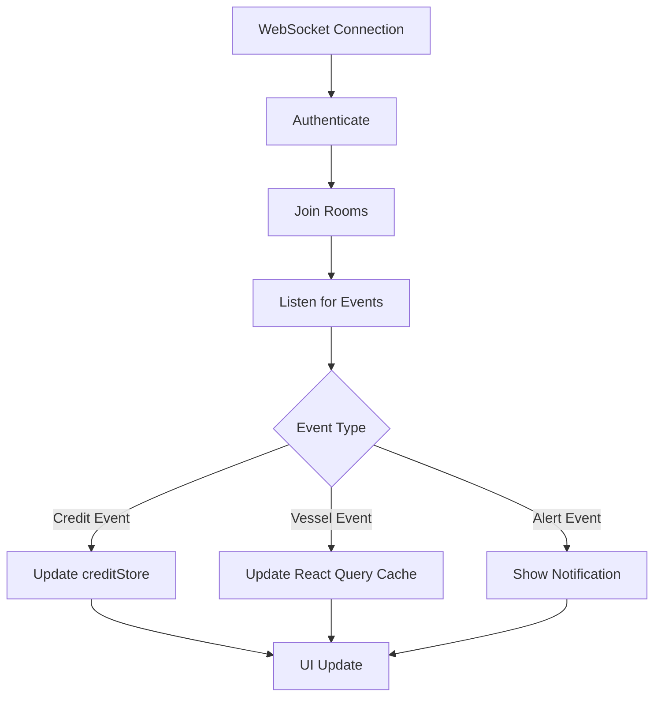

# State Flow Architecture

This document describes the state management architecture of the SIM application, including data flow patterns, store responsibilities, and synchronization strategies.

## Overview

The SIM application uses a layered state management approach:

1. **Server State** - Managed by React Query (TanStack Query)
2. **Client State** - Managed by Zustand stores
3. **Real-time Updates** - Synchronized via WebSocket
4. **UI State** - Managed by React component state

## State Stores

### 1. Authentication Store (`authStore`)

**Location**: `/src/features/auth/services/authStore.ts`

**Responsibilities**:

- User authentication state
- User profile data
- Session management

**Key State**:

```typescript
{
  user: User | null
  isAuthenticated: boolean
}
```

**Persistence**: localStorage (user data only, tokens in httpOnly cookies)

### 2. Credit Store (`creditStore`) - Single Source of Truth

**Location**: `/src/features/credits/services/creditStore.ts`

**Responsibilities**:

- Credit balance management (single source of truth)
- Transaction history caching
- Credit reservations
- Real-time balance updates

**Key State**:

```typescript
{
  balance: number
  lifetimeCredits: number
  expiringCredits: { amount: number, date: string } | null
  recentTransactions: CreditTransaction[]
  reservations: Map<string, CreditReservation>
}
```

**Persistence**: localStorage (balance data only)

**WebSocket Events**:

- `credit_balance_updated`
- `credit_deducted`
- `credit_purchased`

### 3. Cart Store (`cartStore`)

**Location**: `/src/stores/cartStore.ts`

**Responsibilities**:

- Shopping cart state
- Temporary purchase items
- Cart calculations

**Key State**:

```typescript
{
  items: CartItem[]
  total: number
}
```

**Persistence**: sessionStorage

## Data Flow Patterns

### 1. Credit Balance Updates



### 2. Authentication Flow



### 3. Real-time Updates



## State Synchronization

### Server State (React Query)

All server data is managed by React Query with the following patterns:

```typescript
// Query Keys
const vesselKeys = {
  all: ['vessels'] as const,
  lists: () => [...vesselKeys.all, 'list'] as const,
  list: (filters: string) => [...vesselKeys.lists(), { filters }] as const,
  details: () => [...vesselKeys.all, 'detail'] as const,
  detail: (id: string) => [...vesselKeys.details(), id] as const,
}

// Usage
const { data, isLoading } = useQuery({
  queryKey: vesselKeys.detail(vesselId),
  queryFn: () => vesselService.getVessel(vesselId),
  staleTime: 5 * 60 * 1000, // 5 minutes
})
```

### Client State Updates

1. **Optimistic Updates**:

```typescript
// In creditStore
optimisticUpdate: (amount) =>
  set((state) => ({
    balance: Math.max(0, state.balance + amount),
    isUpdating: true,
  }))

// Usage
const previousBalance = creditStore.balance
creditStore.optimisticUpdate(-50)
try {
  await creditService.deductCredits(50)
} catch {
  creditStore.rollbackOptimistic(previousBalance)
}
```

2. **WebSocket Sync**:

```typescript
// Initialize on app start
initializeCreditSync()

// Handles events automatically
websocketService.on('credit_balance_updated', (data) => {
  creditStore.updateBalance(data.balance)
})
```

## Best Practices

### 1. Single Source of Truth

- **Credits**: Always use `creditStore` - NEVER store credit balance elsewhere
- **User Data**: Use `authStore` for user profile (except credits)
- **Server Data**: Use React Query for all API data

### 2. State Updates

```typescript
// ✅ Good - Update through store
creditStore.updateBalance(newBalance)

// ❌ Bad - Direct mutation
user.credits = newBalance
```

### 3. Data Fetching

```typescript
// ✅ Good - Use React Query
const { data } = useQuery({
  queryKey: ['vessels'],
  queryFn: vesselService.getVessels,
})

// ❌ Bad - Manual state management
const [vessels, setVessels] = useState([])
useEffect(() => {
  vesselService.getVessels().then(setVessels)
}, [])
```

### 4. WebSocket Events

```typescript
// ✅ Good - Update appropriate store
websocketService.on('credit_balance_updated', (data) => {
  creditStore.updateBalance(data.balance)
})

// ❌ Bad - Update UI directly
websocketService.on('credit_balance_updated', (data) => {
  setBalance(data.balance) // Component state
})
```

## State Debugging

### Chrome DevTools

1. **React Query Devtools**: Inspect cache, queries, and mutations
2. **Redux DevTools**: Works with Zustand stores when configured
3. **Network Tab**: Monitor WebSocket messages

### Logging

```typescript
// Enable state logging
if (import.meta.env.DEV) {
  creditStore.subscribe((state) => {
    console.log('Credit state updated:', state)
  })
}
```

## Migration Notes

### Credit Balance Migration

The credit balance has been migrated from `authStore` to `creditStore`:

```typescript
// Old (deprecated)
const credits = useAuthStore((state) => state.user?.credits)

// New (use this)
const credits = useCreditStore((state) => state.balance)
```

The `user.credits` field in authStore is deprecated and will be removed in a future version.

## Architecture Decisions

### Why Zustand?

- Simple API with TypeScript support
- Built-in persistence middleware
- Minimal boilerplate
- Good performance with selectors

### Why React Query?

- Automatic caching and invalidation
- Built-in loading and error states
- Optimistic updates
- Background refetching

### Why WebSocket for Credits?

- Real-time balance updates across tabs/devices
- Prevent overspending with instant sync
- Better user experience

## Future Improvements

1. **State Devtools Integration**: Add Zustand devtools for all stores
2. **State Persistence Strategy**: Implement selective persistence
3. **Offline Support**: Queue mutations when offline
4. **State Versioning**: Handle state migrations gracefully
